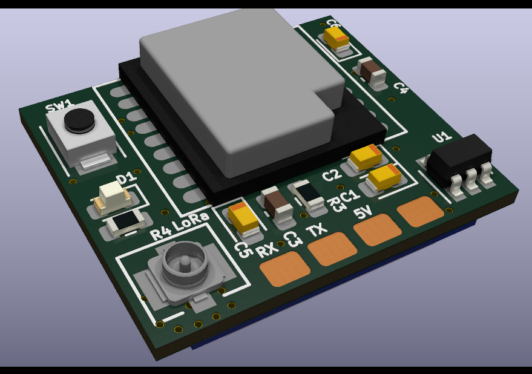

# Mini 2.4GHz RX
This is a sx1280 receiver intended to be easier to solder with only an iron.

## BOM
https://docs.google.com/spreadsheets/d/1p7ZbwzJ3oUK5TnewW_nvrkTnwwBvXO2xWFpPxcCNbLk/edit?usp=sharing

## Build tip
Solder C3, C5 and R3 before the ESP-01F.